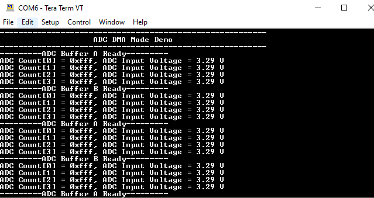

# ADCHS DMA

This example application shows how to sample an analog input using the ADCHS peripheral in DMA mode and displays the converted samples on a serial terminal.

## Description

In this application, an analog input is converted by a hardware trigger generated by the TMR peripheral. The ADCHS is configured to store both the ADC results and the sample count in the buffers provided by the application. ADCHS is configured to save 4 ADC results in Buffer A and Buffer B. Once the Buffer A is full an interrupt is generated and a callback is given to the application. Similarly, when Buffer B is full an interrupt is generated and a callback is given to the application. The application reads the ADC result from the Buffer A or Buffer B and prints the ADC count and corresponding analog value on the serial terminal.

## Downloading and building the application

To clone or download this application from Github, go to the [main page of this repository](https://github.com/Microchip-MPLAB-Harmony/csp_apps_pic32mk) and then click **Clone** button to clone this repository or download as zip file.
This content can also be downloaded using content manager by following these [instructions](https://github.com/Microchip-MPLAB-Harmony/contentmanager/wiki).

Path of the application within the repository is **apps/adchs/adchs_dma/firmware** .

To build the application, refer to the following table and open the project using its IDE.

| Project Name      | Description                                    |
| ----------------- | ---------------------------------------------- |
| pic32mk_gp_db.X | MPLABX project for [PIC32MK GP Development Kit](https://www.microchip.com/developmenttools/ProductDetails/dm320106) |
|||

## Setting up the hardware

The following table shows the target hardware for the application projects.

| Project Name| Board|
|:---------|:---------:|
| pic32mk_gp_db.X | [PIC32MK GP Development Kit](https://www.microchip.com/developmenttools/ProductDetails/dm320106) |
|||

### Setting up [PIC32MK GP Development Kit](https://www.microchip.com/developmenttools/ProductDetails/dm320106)

- Connect the AN1 pin RA0 (Pin 4 of the J29) to analog input voltage
- Connect the Debug USB port (J12) on the board to the computer using a micro USB cable
- Connect the USB to UART port (J25) on the board to the computer using a micro USB cable

## Running the Application

1. Open the Terminal application (Ex.:Tera term) on the computer
2. Connect to the "USB to UART" COM port and configure the serial settings as follows:
    - Baud : 115200
    - Data : 8 Bits
    - Parity : None
    - Stop : 1 Bit
    - Flow Control : None
3. Build and Program the application project using its IDE
4. Console displays the ADC count and the ADC input voltage for Buffer A and then Buffer B

