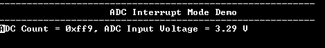

# ADCHS Interrupt

This example application shows how to sample an analog input using the ADCHS peripheral and displays the converted samples on a serial terminal.

## Description

In this application, an analog input is converted by a hardware trigger generated by the TMR peripheral. Result is read in the conversion complete interrupt handler. Converted digital value is displayed on the serial terminal.

## Downloading and building the application

To clone or download this application from Github, go to the [main page of this repository](https://github.com/Microchip-MPLAB-Harmony/csp_apps_pic32mk) and then click **Clone** button to clone this repository or download as zip file.
This content can also be downloaded using content manager by following these [instructions](https://github.com/Microchip-MPLAB-Harmony/contentmanager/wiki).

Path of the application within the repository is **apps/adchs/adchs_interrupt/firmware** .

To build the application, refer to the following table and open the project using its IDE.

| Project Name      | Description                                    |
| ----------------- | ---------------------------------------------- |
| pic32mk_gp_db.X | MPLABX project for [PIC32MK GP Development Kit](https://www.microchip.com/developmenttools/ProductDetails/dm320106) |
| pic32mk_mcj_curiosity_pro.X | MPLABX project for PIC32MK MCJ Curiosity Pro Board |
| pic32mk_mcm_curiosity_pro.X | MPLABX project for PIC32MK MCM Curiosity Pro Board |
|||

## Setting up the hardware

The following table shows the target hardware for the application projects.

| Project Name| Board|
|:---------|:---------:|
| pic32mk_gp_db.X | [PIC32MK GP Development Kit](https://www.microchip.com/developmenttools/ProductDetails/dm320106) |
| pic32mk_mcj_curiosity_pro.X | PIC32MK MCJ Curiosity Pro Board |
| pic32mk_mcm_curiosity_pro.X | PIC32MK MCM Curiosity Pro Board |
|||

### Setting up [PIC32MK GP Development Kit](https://www.microchip.com/developmenttools/ProductDetails/dm320106)

- Connect the AN3 pin RB1 (Pin 15 of the J8) to the Vcc (Pin 7 of the J31)
- Connect the Debug USB port (J12) on the board to the computer using a micro USB cable
- Connect the USB to UART port (J25) on the board to the computer using a micro USB cable

### Setting up PIC32MK MCJ Curiosity Pro Board

- Connect the AN3 pin RB1 (Pin 6 of the J502) to the Vcc (Pin 20 of the J502)
- Connect the Debug USB port (J1) on the board to the computer using a micro USB cable (This will enumerate the virtual COM port)

### Setting up PIC32MK MCM Curiosity Pro Board

- Connect the AN0 pin RA0 (Pin 0 of the J300) to the Vcc (Pin 7 of the J300)
- Connect the Debug USB port (J500) on the board to the computer using a micro USB cable
- Connect the USB to UART port (J400) on the board to the computer using a micro USB cable

## Running the Application

1. Open the Terminal application (Ex.:Tera term) on the computer
2. Connect to the "USB to UART" COM port and configure the serial settings as follows:
    - Baud : 115200
    - Data : 8 Bits
    - Parity : None
    - Stop : 1 Bit
    - Flow Control : None
3. Build and Program the application project using its IDE
4. Console displays the ADC count and the ADC input voltage

