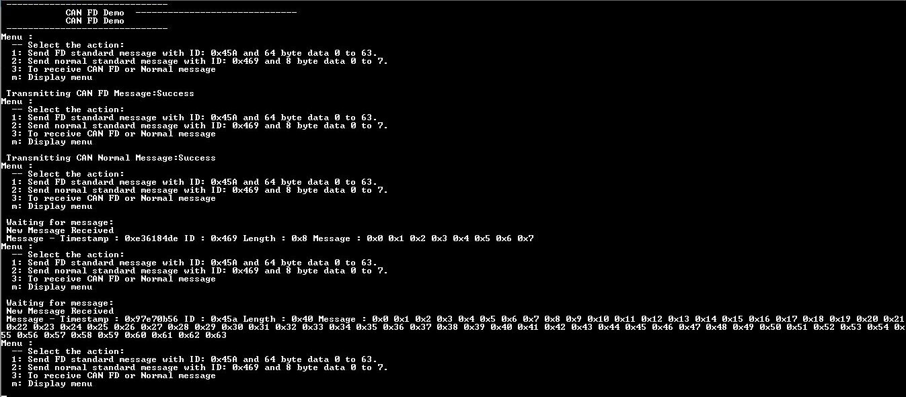
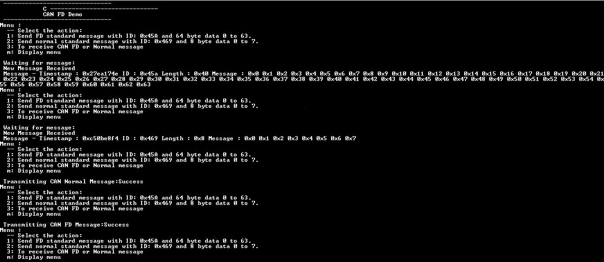

# CAN FD interrupt

This example application shows how to use the CAN module to transmit and receive CAN FD messages in interrupt mode.

## Description

This application transmits CAN FD message to CAN Bus and receives CAN FD message from CAN Bus. To run this application, two evaluation boards of same type are required. These boards acts as different nodes on the CAN bus. Same application is programmed onto both the boards. Boards are connected to PC via UART. While running the application, user can send and receive CAN FD messages between the boards using UART console applications running on the PC.

## Downloading and building the application

To clone or download this application from Github, go to the [main page of this repository](https://github.com/Microchip-MPLAB-Harmony/csp_apps_pic32mk) and then click **Clone** button to clone this repository or download as zip file.
This content can also be downloaded using content manager by following these [instructions](https://github.com/Microchip-MPLAB-Harmony/contentmanager/wiki).

Path of the application within the repository is **apps/can/can_fd_operation_interrupt_timestamp/firmware** .

To build the application, refer to the following table and open the project using its IDE.

| Project Name      | Description                                    |
| ----------------- | ---------------------------------------------- |
| pic32mk_mcj_curiosity_pro.X | MPLABX project for PIC32MK MCJ Curiosity Pro Board |
| pic32mk_mcm_curiosity_pro.X | MPLABX project for PIC32MK MCM Curiosity Pro Board |
|||

## Setting up the hardware

The following table shows the target hardware for the application projects.

| Project Name| Board|
|:---------|:---------:|
| pic32mk_mcj_curiosity_pro.X | PIC32MK MCJ Curiosity Pro Board |
| pic32mk_mcm_curiosity_pro.X | PIC32MK MCM Curiosity Pro Board |
|||

### Setting up PIC32MK MCJ Curiosity Pro Board

- Connect the Debug USB port (J1) to the computer using a micro USB cable for each board (This will enumerate the Virtual COM Port on PC)
- Connect PIC32MK MCJ Curiosity Pro Board to another PIC32MK MCJ Curiosity Pro Board as per the pin connections shown below:

   | PIC32MK MCJ Curiosity Pro Board - 1 | PIC32MK MCJ Curiosity Pro Board - 2 |
   |:-----------------------------------:|:-----------------------------------:|
   | J504, CANH, PIN 1 | J504, CANH, PIN 1 |
   | J504, GND, PIN 2  | J504, GND, PIN 2  |
   | J504, CANL, PIN 3 | J504, CANL, PIN 3 |
   |||

### Setting up PIC32MK MCM Curiosity Pro Board

- Connect DB9 male to male cable from J402 on PIC32MK MCM Curiosity Pro Board-1 to J402 on PIC32MK MCM Curiosity Pro Board-2
- Connect the USB to UART port (J400) to the computer using a micro USB cable for each board
- Connect the Debug USB port (J500) to the computer using a micro USB cable for each board
- Short (close) J20 Jumper for each board

## Running the Application

1. Open the Terminal application (Ex.:Tera term) on the computer
2. Connect to the DEBUG UART Virtual COM port and configure the serial settings as follows:
    - Baud : 115200
    - Data : 8 Bits
    - Parity : None
    - Stop : 1 Bit
    - Flow Control : None
3. Build and Program the application using its IDE
4. In the console associated with board 2, press "3" to receive a CAN FD message
5. In the console associated with board 1, press "2" to transmit a CAN FD message
6. Transmitted message description and status will be displayed in the console window of board 1
7. Received message will be displayed in the console window of board 2
8. Follow the sequence below to send and receive different messages:
    - Press '3' on board 2 and Press '2' on board 1
    - Press '3' on board 2 and Press '1' on board 1
    - Press '3' on board 2 and Press '2' on board 1
9. If the steps are executed in this sequence, the final output in the consoles will be as below (console on the top is the transmitter (board 1) and the one on the bottom is receiver (board 2)):

    

    
