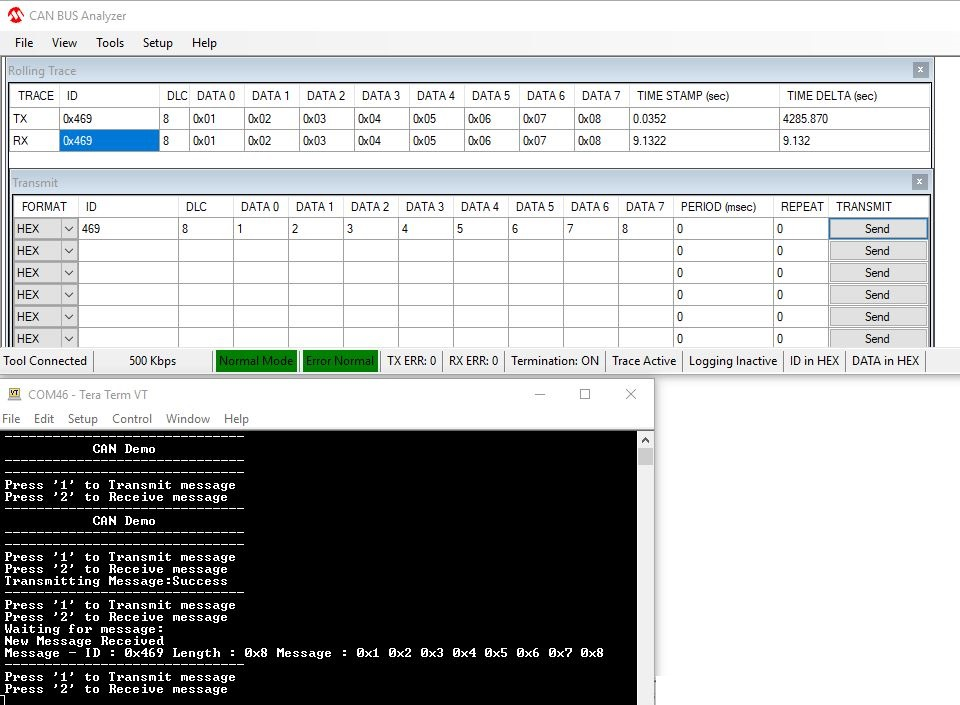

# CAN interrupt

This example application shows how to use the CAN module to transmit and receive normal CAN messages in interrupt mode.

## Description

This application transmits CAN message to CAN Bus and receives CAN message from CAN Bus. To run this application, an evaluation board and [Microchip CAN Bus Analyzer](http://www.microchip.com/Developmenttools/ProductDetails/APGDT002) is required . They act as different nodes on the CAN bus. While running the application, user can send and receive CAN messages between the board and the analyzer.

## Downloading and building the application

To clone or download this application from Github, go to the [main page of this repository](https://github.com/Microchip-MPLAB-Harmony/csp_apps_pic32mk) and then click **Clone** button to clone this repository or download as zip file.
This content can also be downloaded using content manager by following these [instructions](https://github.com/Microchip-MPLAB-Harmony/contentmanager/wiki).

Path of the application within the repository is **apps/can/can_normal_operation_interrupt_timestamp/firmware** .

To build the application, refer to the following table and open the project using its IDE.

| Project Name      | Description                                    |
| ----------------- | ---------------------------------------------- |
| pic32mk_gp_db.X | MPLABX project for [PIC32MK GP Development Kit](https://www.microchip.com/developmenttools/ProductDetails/dm320106) |
|||

## Setting up the hardware

The following table shows the target hardware for the application projects.

| Project Name| Board|
|:---------|:---------:|
| pic32mk_gp_db.X | [PIC32MK GP Development Kit](https://www.microchip.com/developmenttools/ProductDetails/dm320106) |
|||

### Setting up [PIC32MK GP Development Kit](https://www.microchip.com/developmenttools/ProductDetails/dm320106)

- To run the demo, the following additional hardware are required:
  - [Microchip CAN Bus Analyzer](http://www.microchip.com/Developmenttools/ProductDetails/APGDT002)

- Install [Microchip CAN Bus Analyzer](http://www.microchip.com/Developmenttools/ProductDetails/APGDT002) software on PC
- Connect [Microchip CAN Bus Analyzer](http://www.microchip.com/Developmenttools/ProductDetails/APGDT002) to J18 connector using male to female DB9 serial cable
- Connect [Microchip CAN Bus Analyzer](http://www.microchip.com/Developmenttools/ProductDetails/APGDT002) to PC using USB Male-A to Male Mini-B cable
- Short (close) J20 Jumper
- Connect the Debug USB port (J12) on the board to the computer using a micro USB cable
- Connect the USB to UART port (J25) on the board to the computer using a micro USB cable

## Running the Application

1. Build and program the application project using its respective IDE
2. Open [Microchip CAN Bus Analyzer](http://www.microchip.com/Developmenttools/ProductDetails/APGDT002) software and make the following configurations:

    |Description | Settings  |
    | ---------- | --------- |
    | CAN Bitrate Control | 500 Kbps |
    | CAN Mode Control | Normal Mode |
    | Bus Termination Control | ON  |
    |||

3. Connect to the DEBUG UART Virtual COM port and configure the serial settings as follows:
    - Baud : 115200
    - Data : 8 Bits
    - Parity : None
    - Stop : 1 Bit
    - Flow Control : None
4. Press '1' to transmit message to CAN Bus on console window of the board
5. "Transmitting Message:Success" will be displayed in the console window of PIC32MK GP DB board board
6. CAN message will be displayed in the CAN analyzer software
7. Press '2' to receive message from CAN Bus on console window of the board
8. Send following CAN message from CAN analyzer software
    - ID : 0x469, DLC : 8, Data: 1, 2, 3, 4, 5, 6, 7, 8
9. CAN message will be displayed in the terminal window of PIC32MK GP DB board

   

10. LED toggles at each message transmission or reception

   | Board | LED name |
   |------ | -------- |
   | [PIC32MK GP Development Kit](https://www.microchip.com/developmenttools/ProductDetails/dm320106) | LED1 |
   |||
