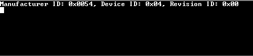
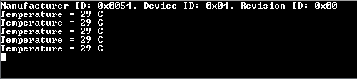

# I2C temperature sensor

This example application demonstrates how to use I2C peripheral to read temperature value from temperature sensor device.

## Description

This example uses the I2C peripheral library to read temperature value from a temperature sensor and then uses UART peripheral library to display it on console.

## Downloading and building the application

To clone or download this application from Github, go to the [main page of this repository](https://github.com/Microchip-MPLAB-Harmony/csp_apps_pic32mk) and then click **Clone** button to clone this repository or download as zip file.
This content can also be downloaded using content manager by following these [instructions](https://github.com/Microchip-MPLAB-Harmony/contentmanager/wiki).

Path of the application within the repository is **apps/i2c/master/i2c_temp_sensor/firmware** .

To build the application, refer to the following table and open the project using its IDE.

| Project Name      | Description                                    |
| ----------------- | ---------------------------------------------- |
| pic32mk_mcj_curiosity_pro.X | MPLABX project for PIC32MK MCJ Curiosity Pro Board |
|||

## Setting up the hardware

The following table shows the target hardware for the application projects.

| Project Name| Board|
|:---------|:---------:|
| pic32mk_mcj_curiosity_pro.X | PIC32MK MCJ Curiosity Pro Board |
|||

### Setting up PIC32MK MCJ Curiosity Pro Board

- Connect micro USB cable to the 'USB Debug' connector on the board to the computer

## Running the Application

1. Open the Terminal application (Ex.:Tera term) on the computer
2. Connect to the "USB to UART" COM port and configure the serial settings as follows:
    - Baud : 115200
    - Data : 8 Bits
    - Parity : None
    - Stop : 1 Bit
    - Flow Control : None
3. Build and Program the application project using its IDE
4. Following message is output on console:

    

5. Now press switch SW200 on the curiosity board, you should start seeing the current temperature value on the console as shown below

    

6. Every time you press the switch, latest temperature value will be displayed
