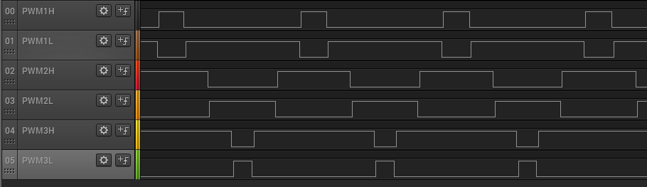

# MCPWM channels

This example demonstrates how to use the MCPWM peripheral to generate PWM signals.

## Description

This example shows how to configure the MCPWM to generate PWM signals whose duty and period can be configured independently.

## Downloading and building the application

To clone or download this application from Github, go to the [main page of this repository](https://github.com/Microchip-MPLAB-Harmony/csp_apps_pic32mk) and then click **Clone** button to clone this repository or download as zip file.
This content can also be downloaded using content manager by following these [instructions](https://github.com/Microchip-MPLAB-Harmony/contentmanager/wiki).

Path of the application within the repository is **apps/mcpwm/mcpwm_channels/firmware** .

To build the application, refer to the following table and open the project using its IDE.

| Project Name      | Description                                    |
| ----------------- | ---------------------------------------------- |
| pic32mk_mcj_curiosity_pro.X | MPLABX project for PIC32MK MCJ Curiosity Pro Board |
|||

## Setting up the hardware

The following table shows the target hardware for the application projects.

| Project Name| Board|
|:---------|:---------:|
| pic32mk_mcj_curiosity_pro.X | PIC32MK MCJ Curiosity Pro Board |
|||

### Setting up PIC32MK MCJ Curiosity Pro Board

- Connect the Debug USB port on the board to the computer using a micro USB cable

## Running the Application

1. Build and program the application project using its IDE
2. Observe the high-side and low-side PWM waveforms on the oscilloscope
3. Observe the dead time between the high side and low side

    

4. Refer to the table below for PWM channels oscilloscope connections:

For PIC32MK MCJ Curiosity Pro Board :

| PWM Channel | Pin |
|------------ |---- |
| PWM1H | RPB14 (Pin 7 of J501 ) |
| PWM1L | RPB15 (Pin 8 of J501 ) |
| PWM2H | RPB12 (Pin 7 of J502 ) |
| PWM2L | RPB13 (Pin 8 of J502 ) |
| PWM3H | RPB10 (Pin 7 of J503 ) |
| PWM3L | RPB11 (Pin 8 of J503 ) |
|||
