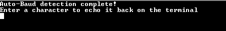

# UART auto-baud

This example application demonstrates how to use auto-baud feature of UART peripheral

## Description

This example application demonstrates how to use auto-baud feature of UART peripheral. After programing the device and connecting to the UART terminal, device detects the baud rate configured in the computer utility and start communicating with that baud rate.

## Downloading and building the application

To download or clone this application from Github, go to the [top level of the repository](https://github.com/Microchip-MPLAB-Harmony/csp_apps_pic32mk) and click

Path of the application within the repository is **apps/uart/uart_autobaud_interrupt/firmware** .

To build the application, refer to the following table and open the project using its IDE.

| Project Name      | Description                                    |
| ----------------- | ---------------------------------------------- |
| pic32mk_gp_db.X | MPLABX project for [PIC32MK GP Development Kit](https://www.microchip.com/developmenttools/ProductDetails/dm320106) |
|||

## Setting up the hardware

The following table shows the target hardware for the application projects.

| Project Name| Board|
|:---------|:---------:|
| pic32mk_gp_db.X | [PIC32MK GP Development Kit](https://www.microchip.com/developmenttools/ProductDetails/dm320106) |
|||

### Setting up [PIC32MK GP Development Kit](https://www.microchip.com/developmenttools/ProductDetails/dm320106)

- Connect the Debug USB port (J12) on the board to the computer using a micro USB cable
- Connect the USB to UART port (J25) on the board to the computer using a micro USB cable

## Running the Application

1. Open the Terminal application (Ex.:Tera term) on the computer
2. Connect to the "USB to UART" COM port and configure the serial settings as follows:
    - Baud : Any
    - Data : 8 Bits
    - Parity : None
    - Stop : 1 Bit
    - Flow Control : None
3. Build and Program the application project using its IDE
4. Console will not show any message in the beginning
5. Type letter "U" in the terminal, that will enable auto-baud and following message appears on the terminal:

