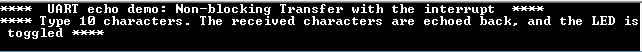

# UART echo interrupt

This example application demonstrates how to use the UART peripheral to transfer a block of data in a non-blocking manner.

## Description

This example shows the read and write operation over a UART in a non-blocking manner. The peripheral interrupt is used to manage the transfer. It receives 10 characters from the terminal window and echoes them back.

## Downloading and building the application

To clone or download this application from Github, go to the [main page of this repository](https://github.com/Microchip-MPLAB-Harmony/csp_apps_pic32mk) and then click **Clone** button to clone this repository or download as zip file.
This content can also be downloaded using content manager by following these [instructions](https://github.com/Microchip-MPLAB-Harmony/contentmanager/wiki).

Path of the application within the repository is **apps/uart/uart_echo_interrupt/firmware** .

To build the application, refer to the following table and open the project using its IDE.

| Project Name      | Description                                    |
| ----------------- | ---------------------------------------------- |
| pic32mk_gp_db.X | MPLABX project for [PIC32MK GP Development Kit](https://www.microchip.com/developmenttools/ProductDetails/dm320106) |
| pic32mk_mcj_curiosity_pro.X | MPLABX project for PIC32MK MCJ Curiosity Pro Board |
| pic32mk_mcm_curiosity_pro.X | MPLABX project for PIC32MK MCM Curiosity Pro Board |
|||

## Setting up the hardware

The following table shows the target hardware for the application projects.

| Project Name| Board|
|:---------|:---------:|
| pic32mk_gp_db.X | [PIC32MK GP Development Kit](https://www.microchip.com/developmenttools/ProductDetails/dm320106) |
| pic32mk_mcj_curiosity_pro.X | PIC32MK MCJ Curiosity Pro Board |
| pic32mk_mcm_curiosity_pro.X | PIC32MK MCM Curiosity Pro Board |
|||

### Setting up [PIC32MK GP Development Kit](https://www.microchip.com/developmenttools/ProductDetails/dm320106)

- Connect the Debug USB port (J12) on the board to the computer using a micro USB cable
- Connect the USB to UART port (J25) on the board to the computer using a micro USB cable

### Setting up PIC32MK MCJ Curiosity Pro Board

- Connect the Debug USB port (J1) on the board to the computer using a micro USB cable

### Setting up PIC32MK MCM Curiosity Pro Board

- Connect the Debug USB port (J500) on the board to the computer using a micro USB cable
- Connect the USB to UART port (J400) on the board to the computer using a micro USB cable

## Running the Application

1. Open the Terminal application (Ex.:Tera term) on the computer
2. Connect to the "USB to UART" COM port and configure the serial settings as follows:
    - Baud : 115200
    - Data : 8 Bits
    - Parity : None
    - Stop : 1 Bit
    - Flow Control : None
3. Build and Program the application project using its IDE
4. See the following message in the console:

    

5. Type 10 characters in terminal
6. Entered 10 characters is echoed back and LED is toggled

Following table provides the LED names:

| Board      | LED Name |
| ---------- |--------- |
|  [PIC32MK GP Development Kit](https://www.microchip.com/developmenttools/ProductDetails/dm320106)  | LED1 |
|  PIC32MK MCJ Curiosity Pro Board  | LED2 |
|  PIC32MK MCM Curiosity Pro Board  | LED1  |
||||
