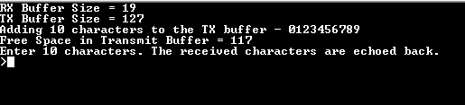
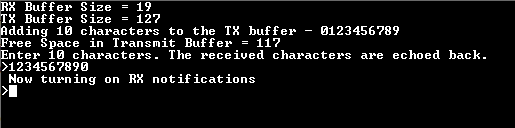
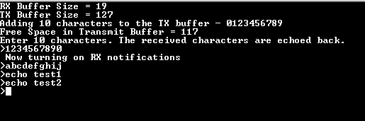

# UART ring buffer

This example application demonstrates how to use the UART peripheral in ring buffer mode.

## Description

This example demonstrates read and write over UART using the ring buffer mode. The UART is configured in non-blocking mode (interrupts enabled). The example asks the user to enter 10 characters. Once received, the characters are echoed back. In the process, the example demonstrates various ring buffer APIs.

## Downloading and building the application

To clone or download this application from Github, go to the [main page of this repository](https://github.com/Microchip-MPLAB-Harmony/csp_apps_pic32mk) and then click **Clone** button to clone this repository or download as zip file.
This content can also be downloaded using content manager by following these [instructions](https://github.com/Microchip-MPLAB-Harmony/contentmanager/wiki).

Path of the application within the repository is **apps/uart/uart_ring_buffer_interrupt/firmware** .

To build the application, refer to the following table and open the project using its IDE.

| Project Name      | Description                                    |
| ----------------- | ---------------------------------------------- |
| pic32mk_gp_db.X | MPLABX project for [PIC32MK GP Development Kit](https://www.microchip.com/developmenttools/ProductDetails/dm320106) |
| pic32mk_mcj_curiosity_pro.X | MPLABX project for PIC32MK MCJ Curiosity Pro Board |
| pic32mk_mcm_curiosity_pro.X | MPLABX project for PIC32MK MCM Curiosity Pro Board |
|||

## Setting up the hardware

The following table shows the target hardware for the application projects.

| Project Name| Board|
|:---------|:---------:|
| pic32mk_gp_db.X | [PIC32MK GP Development Kit](https://www.microchip.com/developmenttools/ProductDetails/dm320106) |
| pic32mk_mcj_curiosity_pro.X | PIC32MK MCJ Curiosity Pro Board |
| pic32mk_mcm_curiosity_pro.X | PIC32MK MCM Curiosity Pro Board |
|||

### Setting up [PIC32MK GP Development Kit](https://www.microchip.com/developmenttools/ProductDetails/dm320106)

- Connect the Debug USB port (J12) on the board to the computer using a micro USB cable
- Connect the USB to UART port (J25) on the board to the computer using a micro USB cable

### Setting up PIC32MK MCJ Curiosity Pro Board

- Connect the Debug USB port (J1) on the board to the computer using a micro USB cable

### Setting up PIC32MK MCM Curiosity Pro Board

- Connect the Debug USB port (J500) on the board to the computer using a micro USB cable
- Connect the USB to UART port (J400) on the board to the computer using a micro USB cable

## Running the Application

1. Open the Terminal application (Ex.:Tera term) on the computer
2. Connect to the EDBG Virtual COM port and configure the serial settings as follows:
    - Baud : 115200
    - Data : 8 Bits
    - Parity : None
    - Stop : 1 Bit
    - Flow Control : None
3. Build and Program the application using its IDE
4. The console displays the following message

    

    - Console displays the initial transmit and receive buffer sizes
    - It then adds 10 characters - "0123456789" to the transmit buffer and displays the available free space in the transmit buffer after the 10 characters have been added
    - The message asks the user to enter 10 characters
    - *NOTE: For this example, the "Free Space in Transmit Buffer = xx", where xx can be anything between 117 to 127, depending on the USART baud rate and the CPU execution speed*

5. Enter 10 characters on the terminal
6. Entered characters are echoed back on the console and message is displayed indicating that the receive notification is turned on

    

7. For every 10 characters typed, it will be echoed back on the console

    
